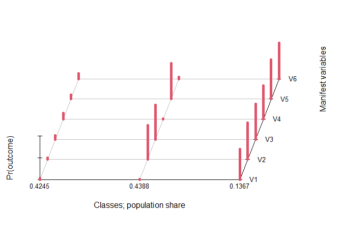

# poLCAExtra : New and convenient functions to improve workflow of `poLCA`

The library `poLCAExtra` offers convenient functions to improve the
workflow of [`poLCA`](https://github.com/dlinzer/poLCA)(Linzer & Lewis,
2011)

``` r
# Current development version
remotes::install_github(repo = "quantmeth/poLCA")
```

# Comparing many latent class models

Either by using many latent

``` r
# poLCAExtra has two data sets examples
jd <- ex1.poLCA

# Formula
f1 <- as.formula(cbind(V1, V2, V3, V4, V5, V6) ~ 1)

# Four latent classes analysis of increasing classes
LCA1 <- poLCA(f1, data = jd, nclass = 1, verbose = FALSE) 
LCA2 <- poLCA(f1, data = jd, nclass = 2, verbose = FALSE)
LCA3 <- poLCA(f1, data = jd, nclass = 3, verbose = FALSE)
LCA4 <- poLCA(f1, data = jd, nclass = 4, maxiter = 1000, nrep = 10, verbose = FALSE)
```

They can be compared with.

``` r
anova(LCA1, LCA2, LCA3, LCA4)
```

    ##   nclass df     llike      AIC      BIC    SABIC   Classes.size Entropy
    ## 1      1 57 -2687.896 5387.793 5415.900 5415.915            800   3.360
    ## 2      2 50 -2365.285 4756.570 4817.470 4817.503        373|427   2.957
    ## 3      3 43 -2195.821 4431.642 4525.334 4525.384    101|345|354   2.746
    ## 4      4 36 -2191.063 4436.127 4562.611 4562.679 99|103|276|322   2.740
    ##   Relative.Entropy     LMR      p
    ## 1                                
    ## 2            0.803 614.576 < .001
    ## 3            0.840 322.830 < .001
    ## 4            0.745   9.063  0.248

The function readily gathers all relevant statitics to choose the number
of classes.

This new version of `poLCA` can also handle many number of classes and
yield the same output.

``` r
LCAE <- poLCA(f1, data = jd, nclass = 1:4)
```

The `plot()` function has been updated to account for the multiple LCA.

``` r
plot(LCAE, nclass = 3)
```

<!-- -->

# New features

The `SABIC` statistic has been added to `poLCA`.

``` r
LCA3$sabic
```

    ## [1] 4525.384

The Lo-Mendell-Rubin statistic has been added.

``` r
poLCA.lmr(LCA3)
```

    ## $vlmr
    ## [1] 338.9282
    ## 
    ## $lmr
    ## [1] 322.83
    ## 
    ## $df
    ## [1] 7
    ## 
    ## $lmr.p
    ## [1] 8.005233e-66

The relative entropy, which is more often requested than the entropy,
has been added.

``` r
poLCA.relentropy(LCA3)
```

    ## [1] 0.8396914

Predicted probabilities and classes

``` r
head(round(predict(LCA3), 3))
```

    ##   Pr(Class==1) Pr(Class==2) Pr(Class==3) Pred
    ## 1        0.004        0.039        0.957    3
    ## 2        0.003        0.020        0.977    3
    ## 3        0.005        0.000        0.994    3
    ## 4        0.003        0.020        0.977    3
    ## 5        0.001        0.455        0.543    3
    ## 6        0.001        0.638        0.362    2

``` r
head(round(predict(LCAE, nclass = 3),3))
```

    ##   Pr(Class==1) Pr(Class==2) Pr(Class==3) Pred
    ## 1        0.039        0.957        0.004    2
    ## 2        0.020        0.977        0.003    2
    ## 3        0.000        0.994        0.005    2
    ## 4        0.020        0.977        0.003    2
    ## 5        0.455        0.543        0.001    2
    ## 6        0.638        0.362        0.001    1

Tech10 (in reference to Mplus) to investigate local independence.

``` r
poLCA.tech10(LCA3)
```

    ## 
    ## The 20 most frequent patterns
    ## 
    ##    pattern observed expected      z   chi llik.contribution     p check
    ## 1   111111      200  201.256 -0.089 0.008            -2.504 0.465      
    ## 23  122121      166  165.339  0.051 0.003             1.325 0.480      
    ## 10  112121       48   47.670  0.048 0.002             0.662 0.481      
    ## 17  121121       42   46.128 -0.608 0.369            -7.875 0.272      
    ## 22  122111       39   37.760  0.202 0.041             2.520 0.420      
    ## 3   111121       38   32.910  0.887 0.787            10.930 0.187      
    ## 5   111211       32   30.693  0.236 0.056             2.669 0.407      
    ## 50  222222       29   28.136  0.163 0.027             1.754 0.435      
    ## 2   111112       25   27.201 -0.422 0.178            -4.219 0.337      
    ## 8   112111       23   28.326 -1.001 1.001            -9.581 0.158      
    ## 15  121111       22   18.606  0.787 0.619             7.373 0.216      
    ## 26  122222       11   12.684 -0.473 0.224            -3.134 0.318      
    ## 24  122122       10   10.900 -0.273 0.074            -1.724 0.393      
    ## 27  211111       10    7.975  0.717 0.514             4.525 0.237      
    ## 46  222122        9    8.921  0.026 0.001             0.159 0.489      
    ## 25  122221        8    5.429  1.103 1.218             6.203 0.135      
    ## 9   112112        7    2.989  2.320 5.382            11.914 0.010     *
    ## 42  221222        7    6.787  0.082 0.007             0.433 0.467      
    ## 6   111212        6    4.251  0.848 0.720             4.135 0.198      
    ## 14  112222        6    2.553  2.157 4.654            10.254 0.015     *
    ## 
    ## Number of empty cells:  14

``` r
poLCA.residual.pattern(LCAE, nclass = 3)
```

    ## 
    ## The 20 most frequent patterns
    ## 
    ##    pattern observed expected      z   chi llik.contribution     p check
    ## 1   111111      200  201.256 -0.089 0.008            -2.504 0.465      
    ## 23  122121      166  165.339  0.051 0.003             1.325 0.480      
    ## 10  112121       48   47.670  0.048 0.002             0.662 0.481      
    ## 17  121121       42   46.128 -0.608 0.369            -7.875 0.272      
    ## 22  122111       39   37.760  0.202 0.041             2.520 0.420      
    ## 3   111121       38   32.910  0.887 0.787            10.930 0.187      
    ## 5   111211       32   30.693  0.236 0.056             2.669 0.407      
    ## 50  222222       29   28.136  0.163 0.027             1.754 0.435      
    ## 2   111112       25   27.201 -0.422 0.178            -4.219 0.337      
    ## 8   112111       23   28.326 -1.001 1.001            -9.581 0.158      
    ## 15  121111       22   18.606  0.787 0.619             7.373 0.216      
    ## 26  122222       11   12.684 -0.473 0.224            -3.134 0.318      
    ## 24  122122       10   10.900 -0.273 0.074            -1.724 0.393      
    ## 27  211111       10    7.975  0.717 0.514             4.525 0.237      
    ## 46  222122        9    8.921  0.026 0.001             0.159 0.489      
    ## 25  122221        8    5.429  1.103 1.218             6.203 0.135      
    ## 9   112112        7    2.989  2.320 5.382            11.914 0.010     *
    ## 42  221222        7    6.787  0.082 0.007             0.433 0.467      
    ## 6   111212        6    4.251  0.848 0.720             4.135 0.198      
    ## 14  112222        6    2.553  2.157 4.654            10.254 0.015     *
    ## 
    ## Number of empty cells:  14

Residual covariances

``` r
poLCA.residual.cov(LCAE, nclass = 3)
```

    ## 
    ##  Residual covariance matrix of Class == 1 
    ##  
    ##       V1    V2    V3    V4    V5    V6
    ## V1 0.067 0.033 0.026 0.056 0.027 0.060
    ## V2 0.033 0.244 0.132 0.011 0.138 0.019
    ## V3 0.026 0.132 0.161 0.014 0.142 0.011
    ## V4 0.056 0.011 0.014 0.026 0.026 0.057
    ## V5 0.027 0.138 0.142 0.026 0.143 0.034
    ## V6 0.060 0.019 0.011 0.057 0.034 0.041
    ## 
    ##  Residual covariance matrix of Class == 2 
    ##  
    ##       V1    V2    V3    V4    V5    V6
    ## V1 0.083 0.029 0.021 0.054 0.028 0.059
    ## V2 0.029 0.121 0.162 0.012 0.165 0.024
    ## V3 0.021 0.162 0.086 0.018 0.104 0.025
    ## V4 0.054 0.012 0.018 0.134 0.014 0.064
    ## V5 0.028 0.165 0.104 0.014 0.100 0.015
    ## V6 0.059 0.024 0.025 0.064 0.015 0.096
    ## 
    ##  Residual covariance matrix of Class == 3 
    ##  
    ##        V1    V2    V3    V4    V5     V6
    ## V1 -0.100 0.017 0.045 0.096 0.054  0.031
    ## V2  0.017 0.115 0.140 0.027 0.133  0.021
    ## V3  0.045 0.140 0.102 0.000 0.128  0.036
    ## V4  0.096 0.027 0.000 0.012 0.010  0.092
    ## V5  0.054 0.133 0.128 0.010 0.160  0.024
    ## V6  0.031 0.021 0.036 0.092 0.024 -0.006

``` r
poLCA.residual.cov(LCA3)
```

    ## 
    ##  Residual covariance matrix of Class == 1 
    ##  
    ##        V1    V2    V3    V4    V5     V6
    ## V1 -0.100 0.017 0.045 0.096 0.054  0.031
    ## V2  0.017 0.115 0.140 0.027 0.133  0.021
    ## V3  0.045 0.140 0.102 0.000 0.128  0.036
    ## V4  0.096 0.027 0.000 0.012 0.010  0.092
    ## V5  0.054 0.133 0.128 0.010 0.160  0.024
    ## V6  0.031 0.021 0.036 0.092 0.024 -0.006
    ## 
    ##  Residual covariance matrix of Class == 2 
    ##  
    ##       V1    V2    V3    V4    V5    V6
    ## V1 0.067 0.033 0.026 0.056 0.027 0.060
    ## V2 0.033 0.244 0.132 0.011 0.138 0.019
    ## V3 0.026 0.132 0.161 0.014 0.142 0.011
    ## V4 0.056 0.011 0.014 0.026 0.026 0.057
    ## V5 0.027 0.138 0.142 0.026 0.143 0.034
    ## V6 0.060 0.019 0.011 0.057 0.034 0.041
    ## 
    ##  Residual covariance matrix of Class == 3 
    ##  
    ##       V1    V2    V3    V4    V5    V6
    ## V1 0.083 0.029 0.021 0.054 0.028 0.059
    ## V2 0.029 0.121 0.162 0.012 0.165 0.024
    ## V3 0.021 0.162 0.086 0.018 0.104 0.025
    ## V4 0.054 0.012 0.018 0.134 0.014 0.064
    ## V5 0.028 0.165 0.104 0.014 0.100 0.015
    ## V6 0.059 0.024 0.025 0.064 0.015 0.096

Bootstrap 3-step approach

``` r
# Tester des variables supplémentaires
d3step("categorical", LCAE, nclass = 3)
```

    ## $stats
    ##            LR           AIC            df             p 
    ##  1.663626e+01 -1.263626e+01  2.000000e+00  8.955622e-04 
    ## 
    ## $M
    ## , , 2.5%
    ## 
    ##                    Pr(Class==1) Pr(Class==2) Pr(Class==3)
    ## Pr(categorical==0)    0.2913308    0.4314527    0.2884085
    ## Pr(categorical==1)    0.6783381    0.5351994    0.6518649
    ## 
    ## , , 50%
    ## 
    ##                    Pr(Class==1) Pr(Class==2) Pr(Class==3)
    ## Pr(categorical==0)    0.3062864     0.447597    0.3181752
    ## Pr(categorical==1)    0.6937136     0.552403    0.6818248
    ## 
    ## , , 97.5%
    ## 
    ##                    Pr(Class==1) Pr(Class==2) Pr(Class==3)
    ## Pr(categorical==0)    0.3216619    0.4648006    0.3481351
    ## Pr(categorical==1)    0.7086692    0.5685473    0.7115915

``` r
d3step("categorical", LCA3)
```

    ## $stats
    ##            LR           AIC            df             p 
    ##  1.653090e+01 -1.253090e+01  2.000000e+00  9.280391e-04 
    ## 
    ## $M
    ## , , 2.5%
    ## 
    ##                    Pr(Class==1) Pr(Class==2) Pr(Class==3)
    ## Pr(categorical==0)    0.2881936    0.2912213    0.4310335
    ## Pr(categorical==1)    0.6538471    0.6791854    0.5364428
    ## 
    ## , , 50%
    ## 
    ##                    Pr(Class==1) Pr(Class==2) Pr(Class==3)
    ## Pr(categorical==0)    0.3176307    0.3066341    0.4475994
    ## Pr(categorical==1)    0.6823693    0.6933659    0.5524006
    ## 
    ## , , 97.5%
    ## 
    ##                    Pr(Class==1) Pr(Class==2) Pr(Class==3)
    ## Pr(categorical==0)    0.3461529    0.3208146    0.4635572
    ## Pr(categorical==1)    0.7118064    0.7087787    0.5689665

``` r
r3step("continuous", LCAE, nclass = 3)
```

    ## $stats
    ##            LR           AIC            df            R2             p 
    ##  1.158558e+01 -1.917117e+01  2.000000e+00  2.853540e-02  5.977013e-05 
    ## 
    ## $M
    ##       Pr(Class==1) Pr(Class==2) Pr(Class==3)
    ## 2.5%      21.47278     23.76746     20.76629
    ## 50%       21.71219     24.01972     21.21170
    ## 97.5%     21.94041     24.26788     21.62965

``` r
r3step("continuous", LCA3)
```

    ## $stats
    ##            LR           AIC            df            R2             p 
    ##  1.155440e+01 -1.910879e+01  2.000000e+00  2.845979e-02  6.015293e-05 
    ## 
    ## $M
    ##       Pr(Class==1) Pr(Class==2) Pr(Class==3)
    ## 2.5%      20.80364     21.46931     23.76805
    ## 50%       21.19910     21.70991     24.01099
    ## 97.5%     21.65531     21.95065     24.27150

The 3-step approches will be improved.

# How to cite

Caron, P.-O. (2024). *poLCAExtra : New and Convenient Functions for the
Package ‘poLCA’*. <https://github.com/quantmeth/poLCAExtra>

# References

<div id="refs" class="references csl-bib-body hanging-indent"
line-spacing="2">

<div id="ref-poLCA" class="csl-entry">

Linzer, D. A., & Lewis, J. B. (2011). <span class="nocase">poLCA</span>:
An R package for polytomous variable latent class analysis. *Journal of
Statistical Software*, *42*(10), 1–29.
<https://www.jstatsoft.org/v42/i10/>

</div>

</div>
