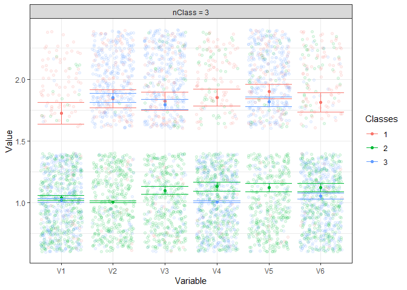
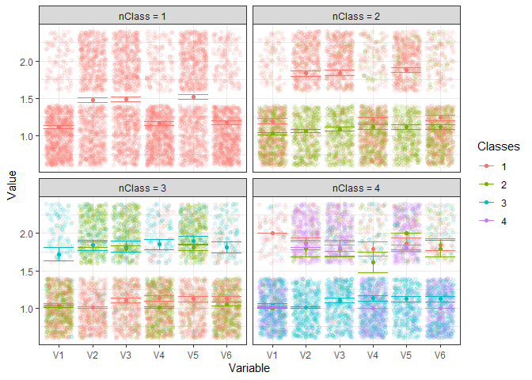
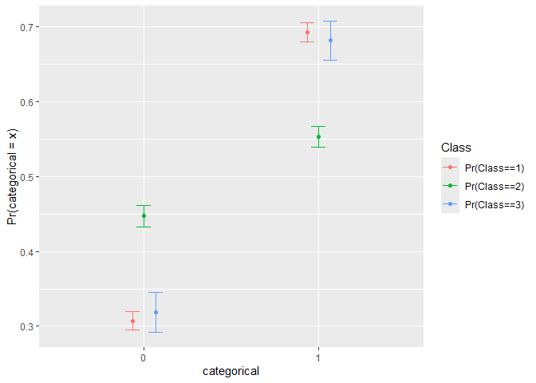
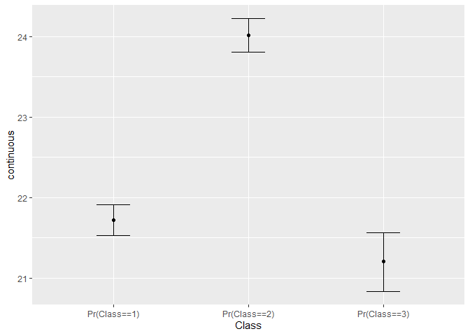

# poLCAExtra : New and convenient functions to improve workflow of `poLCA`

The package `poLCAExtra` offers convenient functions to improve the
workflow of [`poLCA`](https://github.com/dlinzer/poLCA)(Linzer & Lewis,
2011)

``` r
# Current development version
remotes::install_github(repo = "quantmeth/poLCAExtra")
```

# Comparing many latent class models

Either by using many latent class models like

``` r
# poLCAExtra has two data sets examples
jd <- ex1.poLCA

# Formula
f1 <- as.formula(cbind(V1, V2, V3, V4, V5, V6) ~ 1)

# Four latent classes analysis of increasing classes
LCA1 <- poLCA(f1, data = jd, nclass = 1, verbose = FALSE) 
LCA2 <- poLCA(f1, data = jd, nclass = 2, verbose = FALSE)
LCA3 <- poLCA(f1, data = jd, nclass = 3, verbose = FALSE)
LCA4 <- poLCA(f1, data = jd, nclass = 4, maxiter = 1000, nrep = 10, verbose = FALSE)
```

which can then be compared with

``` r
anova(LCA1, LCA2, LCA3, LCA4)
```

    ##  nclass df     llike      AIC      BIC Rel.Entropy     LMR      p  Classes.size
    ##       1 57 -2687.896 5387.793 5415.900                                      800
    ##       2 50 -2463.806 4953.612 5014.512       0.897 426.893 < .001        98|702
    ##       3 43 -2195.821 4431.642 4525.334       0.840 510.513 < .001   101|345|354
    ##       4 36 -2190.270 4434.540 4561.025       0.871  10.574  0.158 49|73|324|354

The function readily gathers some relevant statitics to choose the
number of classes.

This new version of `poLCA` can also handle many number of classes and
yield the same output.

``` r
LCAE <- poLCA(f1, data = jd, nclass = 1:4)
LCAE
```

Both previous tables can be easily exported.

The original `plot()` (from `poLCA`) function has been updated to
account for the multiple LCA.

``` r
plot(LCAE, nclass = 3)
```

<!-- -->

There is also a new plot that works with a single LCA output.

``` r
plot.classes(LCA3)
```

<!-- -->

Or all the LCA output, which may help to compare diffent number of
classes.

``` r
plot.classes(LCAE)
```

<!-- -->

``` r
# If only a subset is required
# plot.classes(LCAE, nclass = 2:3)
# plot.classes(LCA2, LCA3)
```

# New features

## New indices

The `SABIC`, `CAIC`, and `AIC3` statistics have been added to `poLCA`.

``` r
LCA3$sabic
```

    ## [1] 4461.823

``` r
LCA3$caic
```

    ## [1] 4525.359

``` r
LCA3$aic3
```

    ## [1] 4451.642

The relative entropy, which is more often requested than the entropy,
has been added.

``` r
poLCA.relentropy(LCA3)
```

    ## [1] 0.8396916

The Lo-Mendell-Rubin adjusted likelihood ratio test and the
Vuong-Lo-Mendell-Rubin likelihood ratio test have been added.

``` r
poLCA.lrt(LCA3)
```

    ## $vlmr
    ## [1] 338.9282
    ## 
    ## $lmr
    ## [1] 322.83
    ## 
    ## $df
    ## [1] 7
    ## 
    ## $lmr.p
    ## [1] 8.005233e-66
    ## 
    ## $vlmr.p
    ## [1] 2.885461e-69

The bootstrapped Vuong-Lo-Mendell-Rubin likelihood ratio test which is
more generally recommended is also added. Note that the bootstrapped
tests are quite time-consuming.

``` r
poLCA.blrt(LCAE)
```

    ## Vuong-Lo-Mendell-Rubin Likelihood Ratio Test 
    ## 
    ##    test   H0_llik X2loglik_diff npar   mean   s.e.      p
    ##  2 vs 1 -2687.896       645.222    7  8.503  4.249 < .001
    ##  3 vs 2 -2365.285       338.928    7  9.423  4.188 < .001
    ##  4 vs 3 -2195.821        11.102    7 12.085 36.009  0.260
    ## 
    ## At 95% condidence, blrt recommends 3 classes.

``` r
# poLCA.blrt(LCA3)
```

# New functions

## A `predict()` function

Predicted probabilities and classes

``` r
head(round(predict(LCA3), 3))
```

    ##   Pr(Class==1) Pr(Class==2) Pr(Class==3) Pred
    ## 1        0.004        0.039        0.957    3
    ## 2        0.003        0.020        0.977    3
    ## 3        0.005        0.000        0.994    3
    ## 4        0.003        0.020        0.977    3
    ## 5        0.001        0.455        0.543    3
    ## 6        0.001        0.638        0.362    2

``` r
# head(round(predict(LCAE, nclass = 3),3))
```

## Two functions to verify LCA assumptions

Analysis of residual (also known as Tech10 in Mplus) to investigate
local independence.

``` r
poLCA.residual.pattern(LCAE, nclass = 3)
```

    ## The 20 most frequent patterns
    ## 
    ##  pattern observed expected     z  chi llik.contribution    p check
    ##   111111      200   201.26 -0.09 0.01             -2.50 0.46      
    ##   122121      166   165.34  0.05 0.00              1.32 0.48      
    ##   112121       48    47.67  0.05 0.00              0.66 0.48      
    ##   121121       42    46.13 -0.61 0.37             -7.88 0.27      
    ##   122111       39    37.76  0.20 0.04              2.52 0.42      
    ##   111121       38    32.91  0.89 0.79             10.93 0.19      
    ##   111211       32    30.69  0.24 0.06              2.67 0.41      
    ##   222222       29    28.14  0.16 0.03              1.75 0.44      
    ##   111112       25    27.20 -0.42 0.18             -4.22 0.34      
    ##   112111       23    28.33 -1.00 1.00             -9.58 0.16      
    ##   121111       22    18.61  0.79 0.62              7.37 0.22      
    ##   122222       11    12.68 -0.47 0.22             -3.13 0.32      
    ##   122122       10    10.90 -0.27 0.07             -1.72 0.39      
    ##   211111       10     7.97  0.72 0.51              4.53 0.24      
    ##   222122        9     8.92  0.03 0.00              0.16 0.49      
    ##   122221        8     5.43  1.10 1.22              6.20 0.13      
    ##   112112        7     2.99  2.32 5.38             11.91 0.01     *
    ##   221222        7     6.79  0.08 0.01              0.43 0.47      
    ##   111212        6     4.25  0.85 0.72              4.14 0.20      
    ##   112222        6     2.55  2.16 4.65             10.25 0.02     *
    ## 
    ## Number of observed patterns:  50
    ## Number of empty cells:  14
    ## Total number of possible patterns:  64

``` r
# poLCA.tech10(LCA3)
```

Another one to inspect the covariance matrice.

``` r
poLCA.cov(LCAE, nclass = 3)
```

    ## Relevant statistics : 
    ## Chisq :     1.807 
    ## df    :     15 
    ## p     :     1.000 
    ## 
    ## Top 15 covariances : 
    ## 
    ##      pair Observed Expected  chi2     p
    ##  V5 ~~ V1    0.026    0.030 0.558 0.455
    ##  V2 ~~ V1    0.032    0.029 0.449 0.503
    ##  V6 ~~ V4    0.064    0.062 0.230 0.631
    ##  V6 ~~ V2    0.021    0.023 0.160 0.690
    ##  V6 ~~ V3    0.022    0.020 0.101 0.751
    ##  V5 ~~ V3    0.130    0.128 0.097 0.755
    ##  V4 ~~ V2    0.013    0.015 0.088 0.767
    ##  V4 ~~ V3    0.013    0.012 0.032 0.857
    ##  V5 ~~ V4    0.015    0.017 0.032 0.858
    ##  V3 ~~ V1    0.026    0.025 0.017 0.895
    ##  V4 ~~ V1    0.054    0.055 0.016 0.898
    ##  V3 ~~ V2    0.131    0.130 0.013 0.908
    ##  V6 ~~ V1    0.058    0.058 0.010 0.921
    ##  V5 ~~ V2    0.137    0.137 0.003 0.957
    ##  V6 ~~ V5    0.025    0.025 0.000 0.988

``` r
# poLCA.cov(LCA3)
```

<!-- ## A summary -->

## Bootstrap 3-step approach

The 3-step approaches will be improved.

Here are two examples that can be readily be implemented.

``` r
d3 <- d3step("categorical", LCAE, nclass = 3)
# d3step("categorical", LCA3)
d3
```

    ## The statistics
    ##      LR     AIC      df       p 
    ##  16.380 -12.380   2.000   0.001 
    ## 
    ## 
    ## The median and its confidence intervals.
    ## , , Pr(categorical==0)
    ## 
    ##               2.5%   50% 97.5%
    ## Pr(Class==1) 0.292 0.307 0.322
    ## Pr(Class==2) 0.431 0.447 0.464
    ## Pr(Class==3) 0.290 0.318 0.349
    ## 
    ## , , Pr(categorical==1)
    ## 
    ##               2.5%   50% 97.5%
    ## Pr(Class==1) 0.678 0.693 0.708
    ## Pr(Class==2) 0.536 0.553 0.569
    ## Pr(Class==3) 0.651 0.682 0.710

``` r
r3 <- r3step("continuous", LCAE, nclass = 3)
# r3step("continuous", LCA3)
r3
```

    ## The statistics
    ##      LR     AIC      df      R2       p 
    ##  11.458 -18.917   2.000   0.028   0.000 
    ## 
    ## 
    ## The median and its confidence intervals.
    ##                2.5%    50%  97.5%
    ## Pr(Class==1) 21.483 21.723 21.942
    ## Pr(Class==2) 23.758 24.012 24.266
    ## Pr(Class==3) 20.798 21.205 21.639

d3step plot

``` r
plot(d3, ci = c(.05,.95))
```

<!-- --> r3step plot

``` r
plot(r3, ci = c(.05, .95))
```

<!-- -->

# How to cite

Caron, P.-O. (2024). *poLCAExtra : New and Convenient Functions for the
Package ‘poLCA’*. <https://github.com/quantmeth/poLCAExtra>

# References

<div id="refs" class="references csl-bib-body hanging-indent"
line-spacing="2">

<div id="ref-poLCA" class="csl-entry">

Linzer, D. A., & Lewis, J. B. (2011). <span class="nocase">poLCA</span>:
An R package for polytomous variable latent class analysis. *Journal of
Statistical Software*, *42*(10), 1–29.
<https://www.jstatsoft.org/v42/i10/>

</div>

</div>
